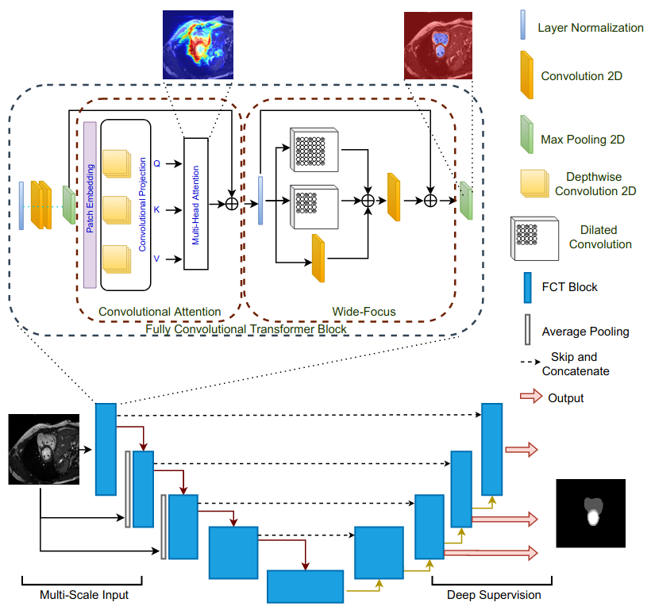

Wavelet modified Fully Convolutional Transformer for Medical Segmentation

A modified FCT architecture that replaces standard pooling/upsampling with learnable Morlet Wavelet transforms, skip encodes detail subbands and has a dynamic wavelet denoise pre-processing layer.

It achieved comparable performance to UNet models with 2.3M parameters and outscored the NN-UNet in Left Atrium segmentation with Mean DICE ED which had 53M Parameters. (0.915 vs 0.902)

Comparison:
Architecture | Original FCT | WaveletFCT
|---|---| --- |
Downsampling | Average Pooling | 2D Discrete Wavelet Transform passing along LL subband
Upsampling | Bilnear interpolation | Inverse Discrete Wavelet Transform 
Preprocessing | None | 2D Wavelet Denoising
Skip Connections | Feature Maps | Feature Maps + Wavelet Subbands (LH, HL, HH)

Dice Results compared to 2019 CAMUS Leaderboard for segmentation

Left Atrium - Mean Dice ED

| Model | Score |
|---|---|
**WaveletFCT** | **0.915**
NN-UNet (Hang-Jung Ling / 53M) | 0.902
CLAS (Hongrong Wei) | 0.902
GUDU (Christoforos Sfakaiankis) | 0.894
U-Net (Sarah Leclerc) | 0.889
ACNN (Ozan Oktay) | 0.881

Left Atrium - Mean Dice ES
|Model  | Score|
|---|---|
NN-UNet (Hang-Jung Ling / 53M) | 0.935
**WaveletFCT** | **0.930**
CLAS (Hongrong Wei) | 0.927
GUDU (Christoforos Sfakaiankis) | 0.926
U-Net (Sarah Leclerc) | 0.918
ACNN (Ozan Oktay) | 0.911

Left Ventricle - Endocardium | Mean Dice ED
|Model | Score |
| --- | --- |
NN-UNet (Hang-Jung Ling / 53M) | 0.952
**WaveletFCT** | **0.950**
CLAS (Hongrong Wei) | 0.947
GUDU (Christoforos Sfakaiankis) | 0.946
U-Net (Sarah Leclerc) | 0.936
ACNN (Ozan Oktay) | 0.936

Left Ventricle - Endocardium | Mean Dice ES
|Model | Score |
| --- | --- |
NN-UNet (Hang-Jung Ling / 53M) | 0.935
**WaveletFCT**| **0.929**
CLAS (Hongrong Wei) | 0.929
GUDU (Christoforos Sfakaiankis) | 0.929
ACNN (Ozan Oktay) | 0.913
U-Net (Sarah Leclerc) | 0.912

Left Ventricle - Epicardium | Mean Dice ED
|Model| Score|
| --- | ---|
NN-UNet (Hang-Jung Ling / 53M) | 0.963
**WaveletFCT**| **0.961**
CLAS (Hongrong Wei) | 0.961
GUDU (Christoforos Sfakaiankis) | 0.960
U-Net (Sarah Leclerc) | 0.956
ACNN (Ozan Oktay) | 0.953

Left Ventricle - Epicardium | Mean Dice ES
|Model|Score|
|---|---|
NN-UNet (Hang-Jung Ling / 53M) | 0.959
**WaveletFCT**| **0.955**
CLAS (Hongrong Wei) | 0.955
GUDU (Christoforos Sfakaiankis) | 0.955
U-Net (Sarah Leclerc) | 0.946
ACNN (Ozan Oktay) | 0.945

This is built off of the original FCT framework proposed in: "The Fully Convolutional Transformer for Medical Image Segmentation" by A. Trangakis et. al.

citations:
Tragakis, Athanasios and Kaul, Chitanya and Murray-Smith, Roderick and Husmeier, Dirk (2022). *The Fully Convolutional Transformer for Medical Image Segmentation. arXiv preprint arXiv:2206.00566.* https://arxiv.org/abs/2206.00566

S. Leclerc, E. Smistad, J. Pedrosa, A. Ostvik, et al.
"Deep Learning for Segmentation using an Open Large-Scale Dataset in 2D Echocardiography" in IEEE Transactions on Medical Imaging, vol. 38, no. 9, pp. 2198-2210, Sept. 2019.

doi: 10.1109/TMI.2019.2900516